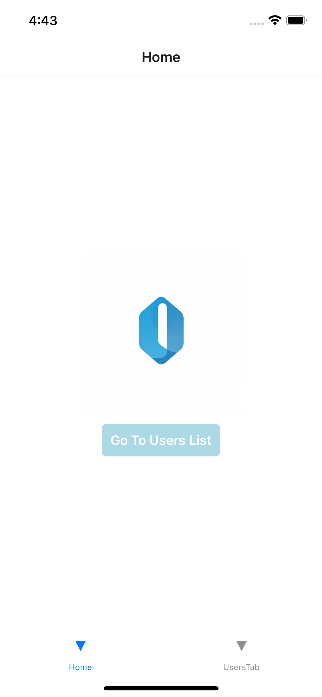
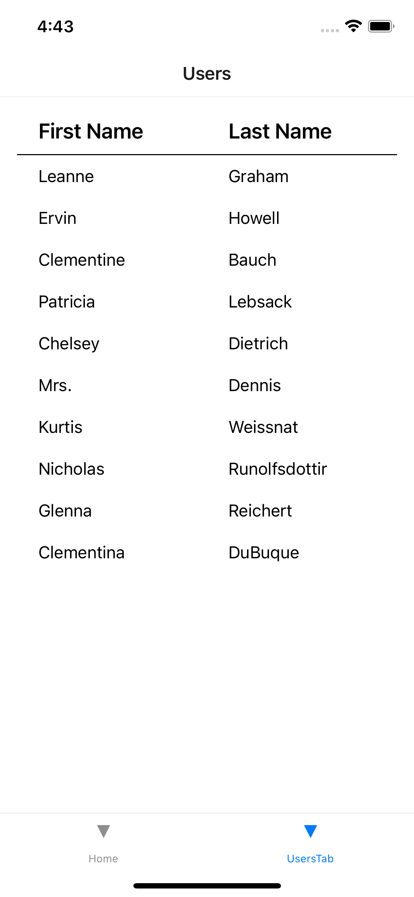
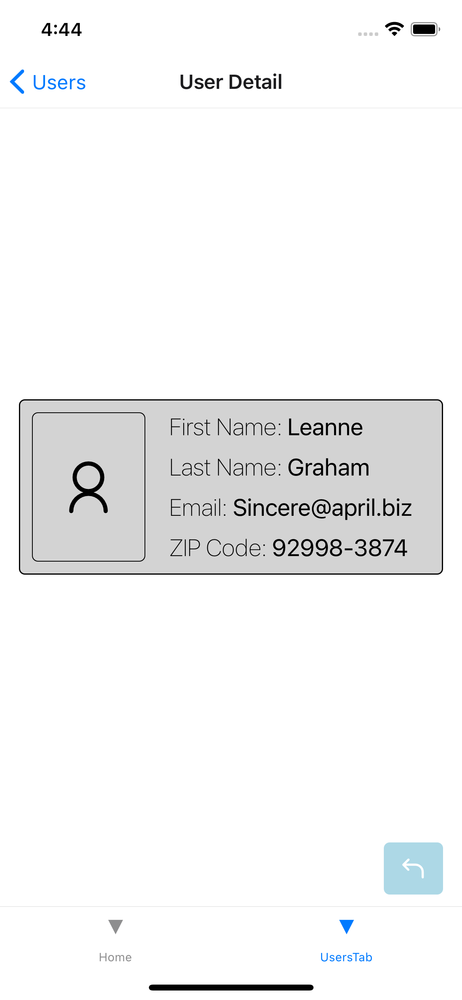

# TEST BY CRISTIAN SANCHEZ

## Description

This is a project made with Expo and React Native, it is a simple app that allows you to see an Logo Icon as a first tab and a list of users as a second tab. The users are fetched from `https://jsonplaceholder.typicode.com/users` and displayed in a FlatList. User details are shown on next screen when a user is clicked.

## Installation

1. Clone the repository
2. Run `yarn` or `npm install` to install the dependencies
3. Run `yarn start` or `npm start` to start the project
4. Download the Expo Go app on your phone
5. Scan the QR code with the Expo Go app on your phone or run it on an emulator.

## Technologies

- React Native
- Expo
- React Navigation
- Redux (RTK)

## Screenshots

1. First Screen (tab logo)
   

2. Second Screen (tab users)
   

3. User Details Screen
   

## Optmiizations

- CreateSelector: The app is optimized for memoization on the UserList and UserDetail components, only selecting the memoized data. This way, re-renders are minimized and only will reload the data when the user changes.

## Tests

All tests will run with `yarn test`

### Unit Tests

Made with Jest and React Testing Library for these components:

- ScreenContainer -> 

- Loader -> 

- Spacer -> 

- AppText -> 

### Integration Tests

Made with Jest and React Testing Library and `msw` for mocking the API calls for these components:

- UserList -> 

- UserDetail -> 
